<p align="center">
  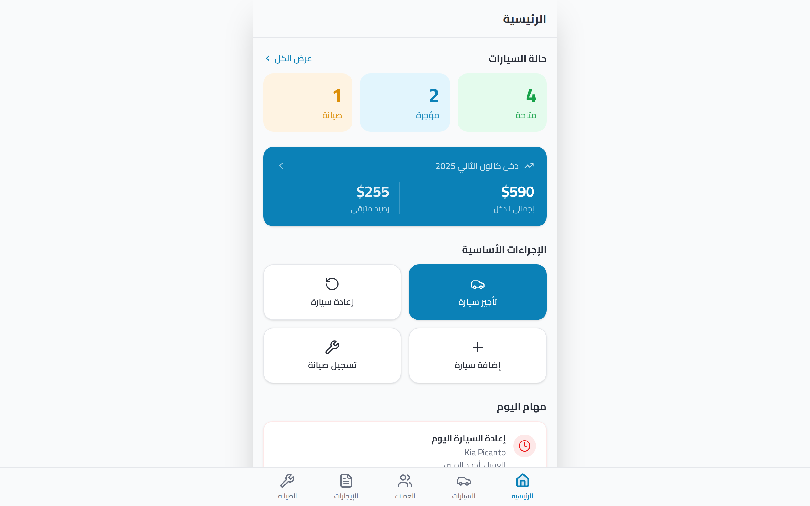
</p>

<h1 align="center">Car Rental Management System</h1>
<p align="center"><strong>نظام تأجير السيارات</strong></p>
<p align="center">A frontend MVP for managing a car rental business — vehicle tracking, customer management, contract handling, payment processing, maintenance scheduling, and analytics.</p>

<p align="center">
  <span style="display: inline-block; padding: 4px 16px; border-radius: 999px; background: #f59e0b20; color: #f59e0b; font-size: 14px; font-weight: 600;">⚡ MVP — Local Mock Data</span>
</p>

<p align="center">
  
  
  
  
  
  
  
</p>

<br>

## Overview

A **frontend-only MVP** for a Car Rental Management System built for the Lebanese market. It demonstrates a complete, production-quality interface for handling daily rental operations — from fleet tracking and customer management to contract creation, payment processing, and maintenance scheduling.

All data currently lives in local mock storage, simulating realistic business scenarios. This validates the product experience before committing to backend infrastructure.

**Who this is for:** Rental business owners, fleet managers, and automotive entrepreneurs who need a modern, mobile-friendly operations tool.

---

## Features

### 🚗 Fleet Management
- **Vehicle inventory** with status tracking (available, rented, maintenance)
- **Detail views** with rental and maintenance history
- **Search and filter** by name, plate, year, or status
- **Add new vehicles** with full registration details

### 👥 Customer Management
- **Customer directory** with phone numbers and locations
- **Detailed profiles** with contact info, payment summary, and rental history
- **Quick actions** — call directly, create rentals from profiles
- **Searchable** by name, phone, or location

### 📋 Rental Operations
- **Multi-step rental creation wizard** — select vehicle, customer, dates, and pricing
- **Payment tracking** with progress bars, history, and remaining balance
- **Return workflow** with date capture and automatic status updates
- **Active / ended views** with segmented tabs
- **Inline payment recording** during active rentals

### 🔧 Maintenance Management
- **Records categorized** by type: oil change, inspection, insurance, registration, repair
- **Status tracking** — upcoming, overdue, completed
- **Overdue alerts** with count badges and quick-filtering
- **Expandable cards** with completion workflow
- **Filter and search** by vehicle or maintenance type

### 📊 Analytics & Reporting
- **Revenue overview** with month-over-month comparison
- **Fleet status breakdown** — available, rented, under maintenance
- **Vehicle revenue ranking** with progress bars
- **Top debtor identification** with balance details
- **Quick stats** — completed rentals, registered customers

### 📈 Dashboard
- **Fleet summary** with clickable stat cards
- **Revenue snapshot** — total income and pending balance
- **Quick actions** — rent, return, add vehicle, schedule maintenance
- **Today's tasks** — ending rentals and overdue maintenance
- **Upcoming maintenance** and **recent activity** feed

### 🌐 Internationalization & UX
- **Arabic (RTL)** interface with Lebanese month names and currency formatting
- **Mobile-first design** with 480px max-width, optimized for on-the-go use
- **Bottom tab navigation** for one-handed operation
- **Smooth animations** (framer-motion) and **toast notifications** (sonner)

---

## Screenshots

<div align="center">
  <table>
    <tr>
      <td align="center">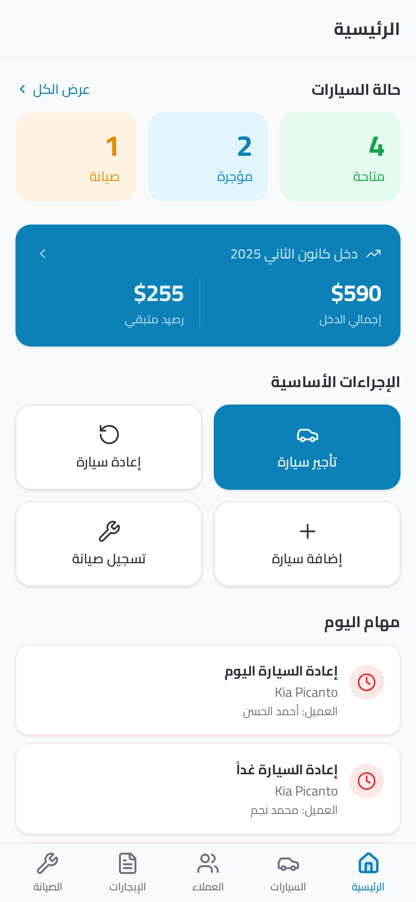<br><sub>Dashboard</sub></td>
      <td align="center">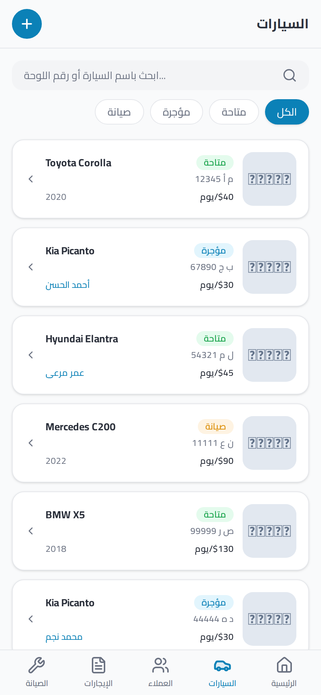<br><sub>Vehicles</sub></td>
      <td align="center">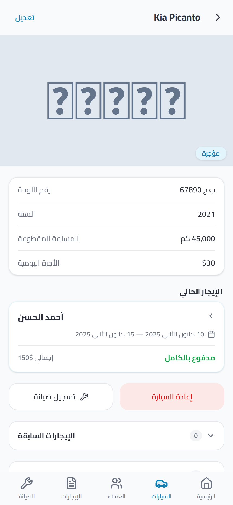<br><sub>Vehicle Detail</sub></td>
      <td align="center">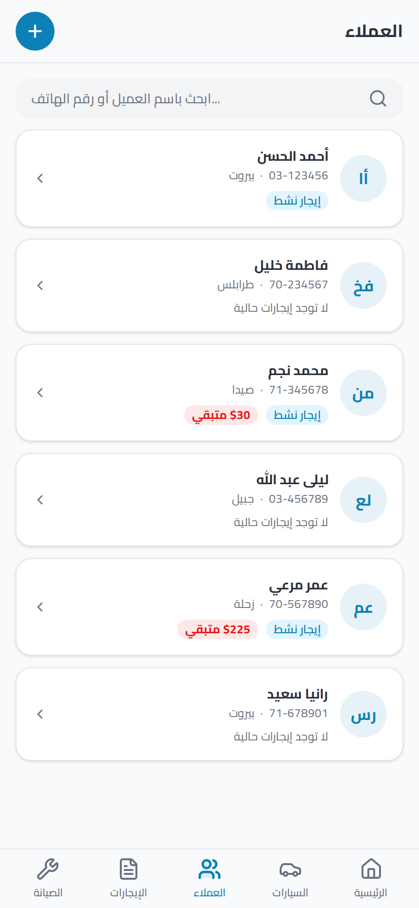<br><sub>Customers</sub></td>
    </tr>
    <tr>
      <td align="center">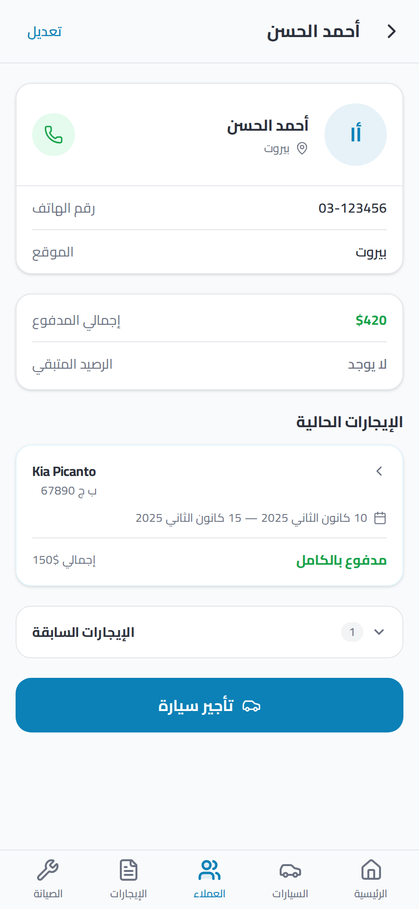<br><sub>Customer Detail</sub></td>
      <td align="center">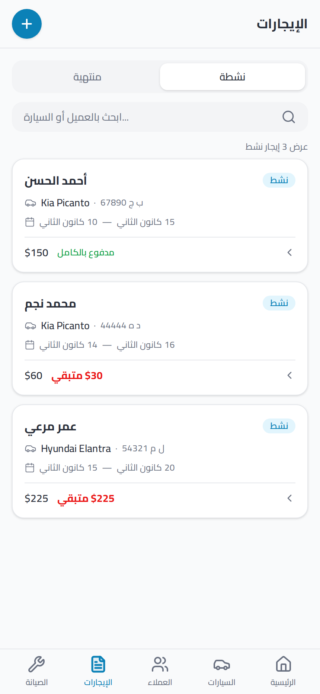<br><sub>Rentals</sub></td>
      <td align="center">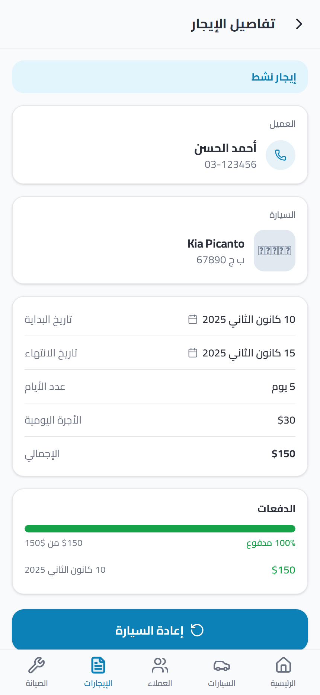<br><sub>Rental Detail</sub></td>
      <td align="center">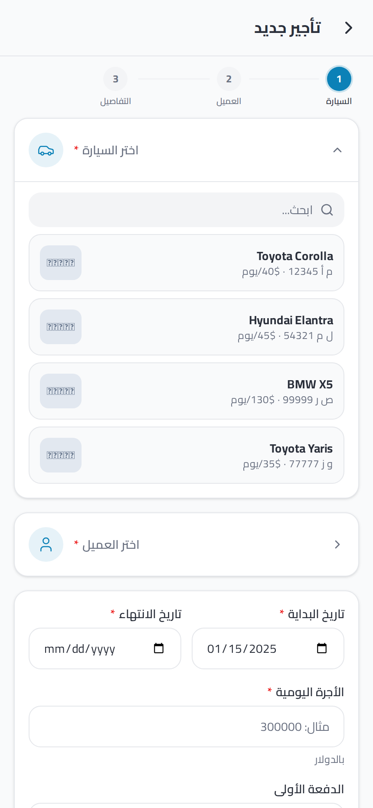<br><sub>New Rental</sub></td>
    </tr>
    <tr>
      <td align="center">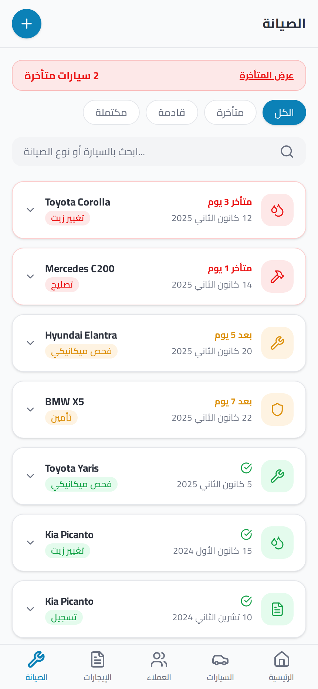<br><sub>Maintenance</sub></td>
      <td align="center">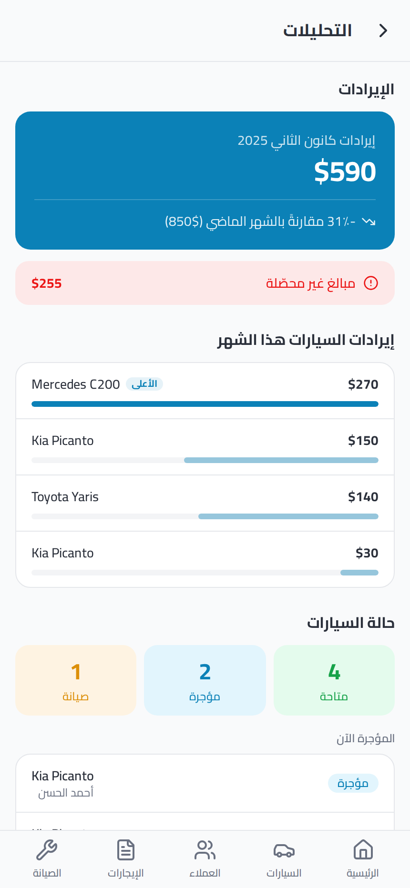<br><sub>Analytics</sub></td>
    </tr>
  </table>
</div>

---

## Tech Stack

| Category | Technology |
|---|---|
| **Framework** | [React 19](https://react.dev/) |
| **Language** | [TypeScript](https://www.typescriptlang.org/) |
| **Build Tool** | [Vite](https://vitejs.dev/) |
| **Routing** | [wouter](https://github.com/molefrog/wouter) |
| **UI Library** | [shadcn/ui](https://ui.shadcn.com/) (New York, neutral) |
| **Styling** | [Tailwind CSS v4](https://tailwindcss.com/) |
| **Components** | [Radix UI](https://www.radix-ui.com/) primitives |
| **Data Fetching** | [TanStack React Query](https://tanstack.com/query) |
| **Animation** | [framer-motion](https://www.framer.com/motion/) |
| **Icons** | [lucide-react](https://lucide.dev/) |
| **Charts** | [recharts](https://recharts.org/) |
| **Forms** | [react-hook-form](https://react-hook-form.com/) + [Zod](https://zod.dev/) |
| **Date Handling** | [date-fns](https://date-fns.org/) + [react-day-picker](https://react-day-picker.js.org/) |
| **Notifications** | [sonner](https://sonner.emilkowal.ski/) |
| **Package Manager** | [pnpm](https://pnpm.io/) |

---

## Project Structure

The frontend lives entirely in `artifacts/car-rental/` and follows a clear feature-first structure:

```
artifacts/car-rental/
└── src/
    ├── App.tsx           # Root component + route definitions
    ├── main.tsx          # Application entry point
    ├── pages/            # 14 page components
    │   ├── DashboardPage.tsx
    │   ├── VehiclesPage.tsx
    │   ├── AddVehiclePage.tsx
    │   ├── VehicleDetailPage.tsx
    │   ├── CustomersPage.tsx
    │   ├── AddCustomerPage.tsx
    │   ├── CustomerDetailPage.tsx
    │   ├── RentalsPage.tsx
    │   ├── NewRentalPage.tsx
    │   ├── RentalDetailPage.tsx
    │   ├── MaintenancePage.tsx
    │   ├── AddMaintenancePage.tsx
    │   ├── AnalyticsPage.tsx
    │   └── not-found.tsx
    ├── components/
    │   ├── layout/       # AppShell, BottomNavigation, PageHeader
    │   ├── ui/           # 69 shadcn/ui + custom components
    │   └── ...
    ├── data/             # Mock data (types, vehicles, customers, rentals, maintenance)
    ├── hooks/            # Custom React hooks
    ├── lib/              # Utilities (format, cn)
    └── index.css         # Tailwind v4 entry
```

---

## Getting Started

```bash
# Prerequisites: Node.js >= 20, pnpm >= 9
pnpm install
pnpm run dev
```

Opens at `http://localhost:5173`.

> **Note:** No backend or database required. All data is seeded in-memory and resets on page reload.

---

## Current Status & Roadmap

This is a **frontend MVP** — fully functional and navigable, operating on local mock data while the API layer is prepared.

### Implemented

- [x] Complete UI with all 14 screens and navigation
- [x] Mock data layer with realistic business scenarios
- [x] Mobile-first RTL Arabic interface
- [x] Search, filter, and sorting on all list pages
- [x] State mutations (add rentals, record payments, return vehicles, complete maintenance)

### In Progress / Planned

- [ ] API integration with real CRUD operations
- [ ] Authentication and user management
- [ ] Persistent PostgreSQL storage (Drizzle ORM schema ready)
- [ ] Receipt and contract PDF generation
- [ ] Vehicle image upload
- [ ] SMS and email notifications for due dates
- [ ] Multi-language support (English + Arabic)
- [ ] Unit and integration tests
- [ ] Deployment and CI/CD

---

## License

[MIT](LICENSE)

---

<p align="center"><sub>Built with React, TypeScript, Tailwind CSS, and shadcn/ui</sub></p>
