<p align="center">
  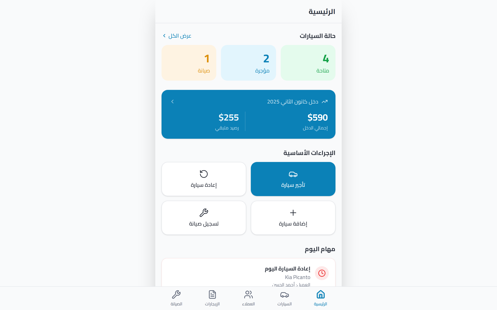
</p>

<h1 align="center">Car Rental Management System</h1>
<h3 align="center" style="font-size: 22px; font-weight: 600; margin: 8px 0 16px 0; color: #6b7280;">نظام تأجير السيارات</h3>
<p align="center">A frontend MVP for managing a car rental business — vehicle tracking, customer management, rental workflow, payment processing, maintenance scheduling, and analytics.</p>

<p align="center">
  <span style="display: inline-block; padding: 4px 16px; border-radius: 999px; background: #f59e0b20; color: #f59e0b; font-size: 14px; font-weight: 600;">⚡ MVP — In-Memory Mock Data</span>
</p>

<p align="center">
  
  
  
  
  
  
  
</p>

<h2 align="center">
  <a href="https://car-rental-management-system-car-re.vercel.app/" style="text-decoration: none; color: inherit;"><strong>🌐 Live Preview</strong></a>
</h2>

## Overview

A **frontend-first MVP** of a Car Rental Management System built for the Lebanese market. It demonstrates a complete, production-quality interface for daily rental operations — fleet tracking, customer management, rental creation, payment processing, and maintenance scheduling.

All data currently lives in **in-memory mock storage** (reset on page reload), simulating realistic business scenarios. This is a deliberate validation step: it proves the product experience before committing to backend infrastructure.

**Who this is for:** Rental business owners, fleet managers, and automotive entrepreneurs who need a modern, mobile-friendly operations tool.

---

## Features

### 🚗 Fleet Management

- **Vehicle inventory** with status tracking (available, rented, maintenance)
- **Detail views** with rental and maintenance history
- **Search by name, plate, or year**, and **filter by status**
- **Add vehicle** — _UI prototype: form and validation are complete, persistence intentionally deferred (see Roadmap)_

### 👥 Customer Management

- **Customer directory** with phone numbers and locations
- **Detailed profiles** with contact info, payment summary, and rental history
- **Quick actions** — call directly, create rentals from profiles
- **Searchable** by name, phone, or location
- **Add customer** — _UI prototype: form and validation are complete, persistence intentionally deferred (see Roadmap)_

### 📋 Rental Operations

- **Multi-step rental creation wizard** — select vehicle, customer, dates, and pricing
- **Payment tracking** with progress bars, history, and remaining balance
- **Return workflow** with date capture and automatic status updates
- **Active / ended views** with segmented tabs
- **Inline payment recording** during active rentals

### 🔧 Maintenance Management

- **Records categorized** by type: oil change, inspection, insurance, registration, repair
- **Status tracking** — upcoming, overdue, completed, **auto-sorted by status and due date**
- **Overdue alerts** with count badges and quick-filtering
- **Expandable cards** with completion workflow
- **Filter and search** by vehicle or maintenance type

### 📊 Analytics & Reporting

- **Revenue overview** with month-over-month comparison
- **Fleet status breakdown** — available, rented, under maintenance
- **Vehicle revenue ranking** with progress bars
- **Top debtor identification** with balance details
- **Quick stats** — completed rentals, registered customers

### 📈 Dashboard

- **Fleet summary** with clickable stat cards
- **Revenue snapshot** — total income and pending balance
- **Quick actions** — rent, return, add vehicle, schedule maintenance
- **Today's tasks** — ending rentals and overdue maintenance
- **Upcoming maintenance** and **recent activity** feed

### 🌐 Internationalization & UX

- **Arabic (RTL)** interface with Lebanese month names and USD currency formatting
- **Mobile-first design** with 480px max-width, optimized for on-the-go use
- **Bottom tab navigation** for one-handed operation
- **Smooth animations** via CSS transitions and **toast notifications** (shadcn/ui toast)

---

## Screenshots

<div align="center">
  <table>
    <tr>
      <td align="center">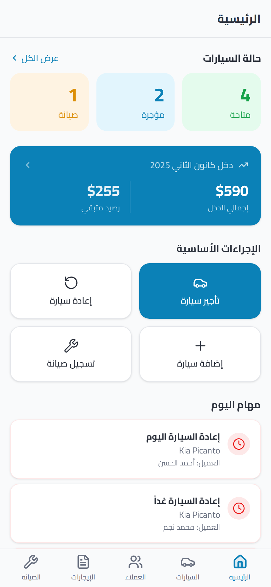<br><sub>Dashboard</sub></td>
      <td align="center">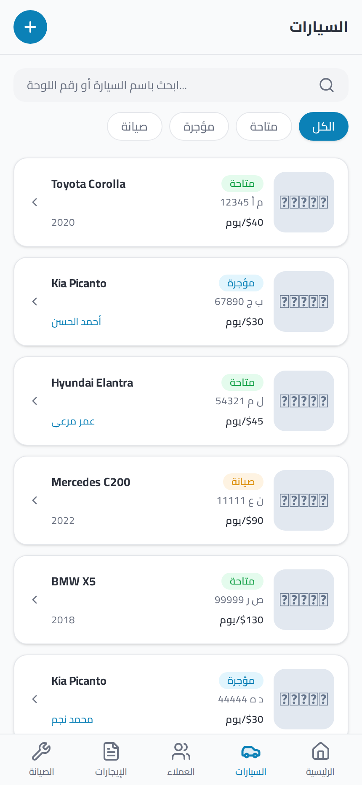<br><sub>Vehicles</sub></td>
      <td align="center">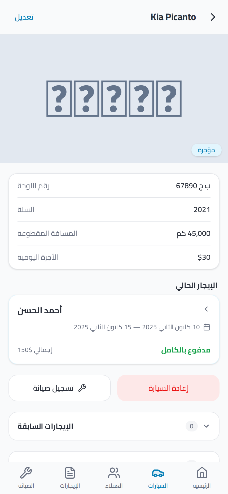<br><sub>Vehicle Detail</sub></td>
      <td align="center">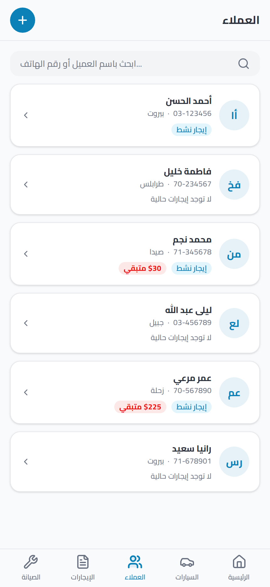<br><sub>Customers</sub></td>
    </tr>
    <tr>
      <td align="center">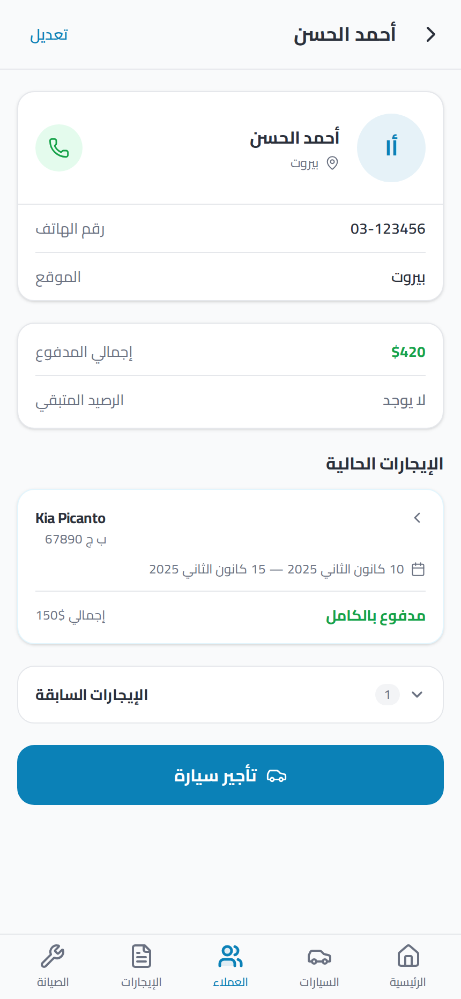<br><sub>Customer Detail</sub></td>
      <td align="center">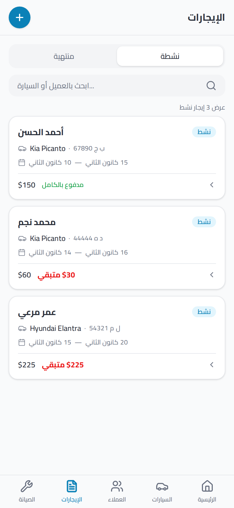<br><sub>Rentals</sub></td>
      <td align="center">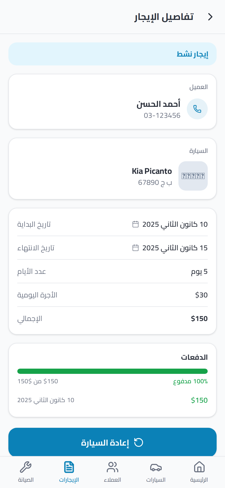<br><sub>Rental Detail</sub></td>
      <td align="center">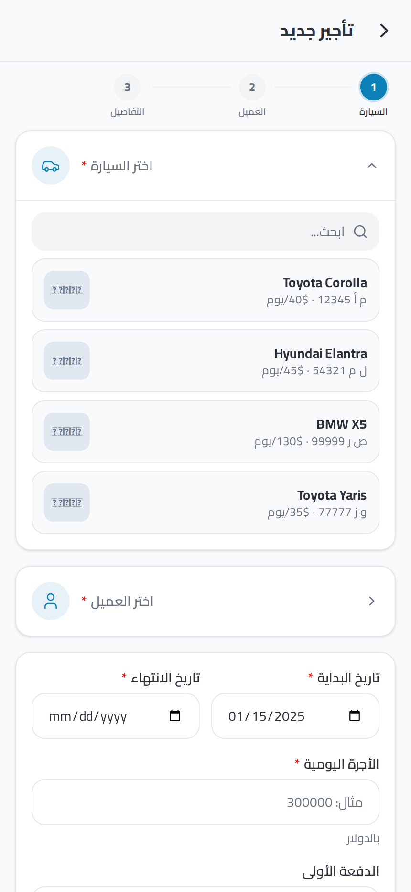<br><sub>New Rental</sub></td>
    </tr>
    <tr>
      <td align="center">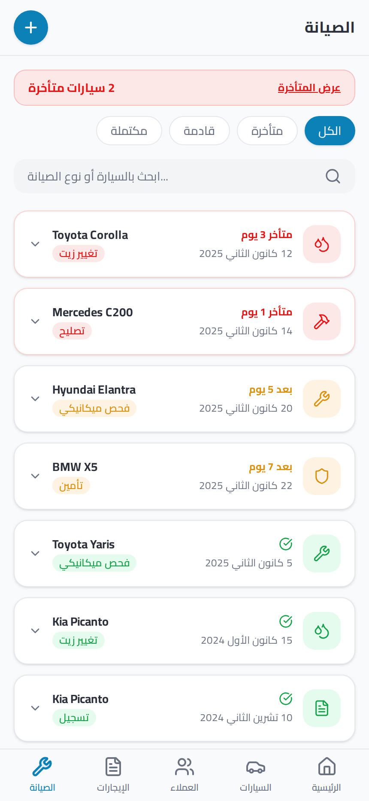<br><sub>Maintenance</sub></td>
      <td align="center">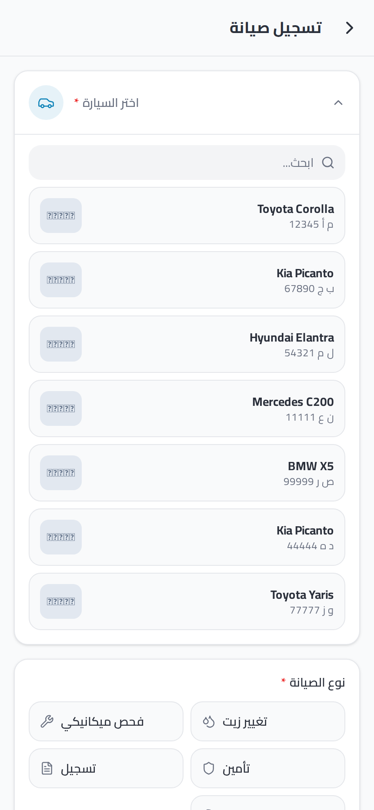<br><sub>Add Maintenance</sub></td>
      <td align="center">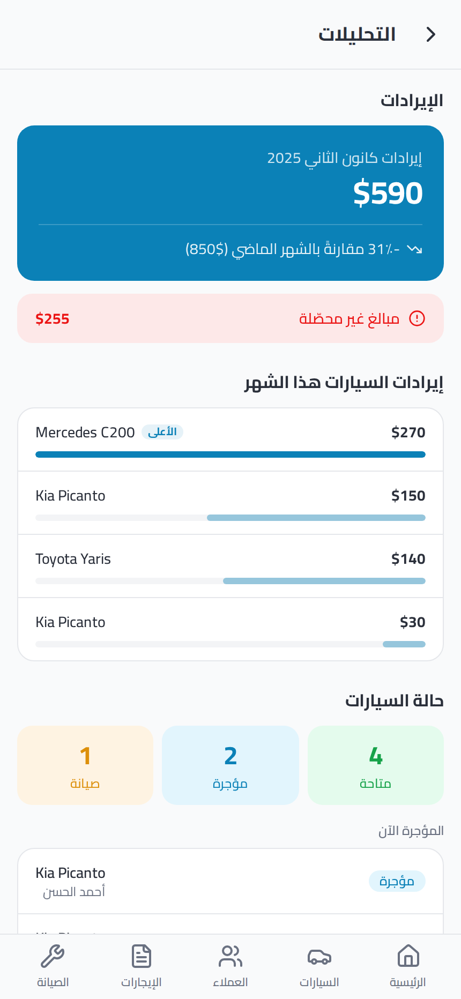<br><sub>Analytics</sub></td>
      <td align="center">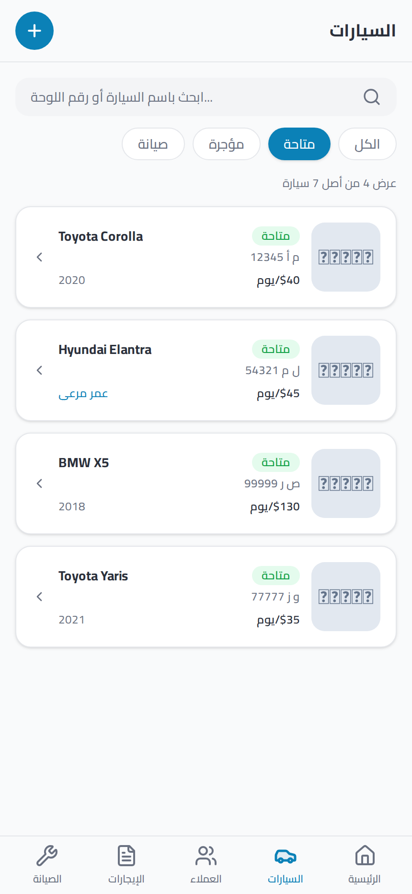<br><sub>Vehicles Available</sub></td>
    </tr>
  </table>
</div>

---

## Tech Stack

### Used in the MVP

| Category            | Technology                                                                               |
| ------------------- | ---------------------------------------------------------------------------------------- |
| **Framework**       | [React 19](https://react.dev/)                                                           |
| **Language**        | [TypeScript](https://www.typescriptlang.org/)                                            |
| **Build Tool**      | [Vite](https://vitejs.dev/)                                                              |
| **Routing**         | [wouter](https://github.com/molefrog/wouter)                                             |
| **UI Library**      | [shadcn/ui](https://ui.shadcn.com/) (New York, neutral)                                  |
| **Styling**         | [Tailwind CSS v4](https://tailwindcss.com/)                                              |
| **Components**      | [Radix UI](https://www.radix-ui.com/) primitives                                         |
| **Icons**           | [lucide-react](https://lucide.dev/)                                                      |
| **Notifications**   | shadcn/ui toast (Radix)                                                                  |
| **Animation**       | CSS transitions (Tailwind)                                                               |
| **Package Manager** | [pnpm](https://pnpm.io/)                                                                 |

### Scaffolded / Planned for Version 2

These libraries are installed and wired into the monorepo's code-generation pipeline (OpenAPI → typed client) but are **not yet driving the UI**. They represent the intended Version 2 architecture.

| Category         | Technology                                                                               |
| ---------------- | ---------------------------------------------------------------------------------------- |
| **Data Fetching**| [TanStack React Query](https://tanstack.com/query) (typed client generated via Orval)    |
| **Forms**        | [react-hook-form](https://react-hook-form.com/) + [Zod](https://zod.dev/)                |
| **Charts**       | [recharts](https://recharts.org/)                                                        |
| **Animation**    | [framer-motion](https://www.framer.com/motion/)                                          |
| **Date Handling**| [date-fns](https://date-fns.org/) + [react-day-picker](https://react-day-picker.js.org/) |
| **Notifications**| [sonner](https://sonner.emilkowal.ski/)                                                  |
| **Backend**      | [Express 5](https://expressjs.com/), [Drizzle ORM](https://orm.drizzle.team/), PostgreSQL|

---

## Architecture

The project is a **pnpm workspace monorepo**. The frontend is a self-contained SPA; the backend and shared libraries exist as a scaffold that defines the contract the frontend will consume in Version 2.

```
artifacts/
├── car-rental/       React 19 + Vite SPA (the main deliverable)
└── api-server/       Express 5 API server — scaffold, health check only
lib/
├── api-spec/         OpenAPI 3.1 spec — source of truth for codegen
├── api-client-react/ Generated React Query hooks (Orval)
├── api-zod/          Generated Zod schemas (Orval)
└── db/               Drizzle ORM + PostgreSQL — scaffold, empty schema
docs/
└── architecture/     Engineering architecture, design system, screen blueprints
```

The frontend reads and writes **in-memory mock data** today. The shared libraries encode the production boundary: `lib/api-spec` is the single source of truth, and Orval generates both the typed React Query client and the Zod validation schemas from it — so wiring the UI to a real API is a codegen step, not a rewrite.

For a deep dive (data flow, workspace packages, build pipeline, decisions), see [`docs/architecture/architecture.md`](docs/architecture/architecture.md).

---

## Design Decisions

- **Why frontend-first?** Validate the product workflow and user experience before investing in backend infrastructure. If owners won't use it, the backend doesn't matter yet.
- **Why in-memory mock data?** Keeps the MVP dependency-free and instantly runnable — no DB or auth required to test the full rental workflow. Reset-on-reload is an accepted trade-off for a validation prototype.
- **Why Arabic RTL?** The target users are Lebanese business owners. Arabic copy, right-to-left layout, and mobile usability are product requirements, not polish.
- **Why a monorepo?** The API contract (`lib/api-spec`) drives code generation for both the typed client and validation schemas. Keeping the spec, generated code, frontend, and backend in one repo makes a single contract change atomic and type-safe across all of them.
- **How does this prepare for Version 2?** The codegen pipeline (OpenAPI → React Query client + Zod schemas + Drizzle layer) is already in place. Moving to production means defining the schema and endpoints, regenerating, and swapping the mock data layer for the generated client — without restructuring the app.

---

## Project Structure

The frontend lives in `artifacts/car-rental/` and follows a feature-first structure:

```
artifacts/car-rental/
└── src/
    ├── App.tsx           # Root component + route definitions
    ├── main.tsx          # Application entry point
    ├── pages/            # 14 page components
    │   ├── DashboardPage.tsx
    │   ├── VehiclesPage.tsx
    │   ├── AddVehiclePage.tsx
    │   ├── VehicleDetailPage.tsx
    │   ├── CustomersPage.tsx
    │   ├── AddCustomerPage.tsx
    │   ├── CustomerDetailPage.tsx
    │   ├── RentalsPage.tsx
    │   ├── NewRentalPage.tsx
    │   ├── RentalDetailPage.tsx
    │   ├── MaintenancePage.tsx
    │   ├── AddMaintenancePage.tsx
    │   ├── AnalyticsPage.tsx
    │   └── not-found.tsx
    ├── components/
    │   ├── layout/       # AppShell, BottomNavigation, PageHeader
    │   └── ui/           # shadcn/ui primitives + domain components (VehicleCard, StatusBadge, …)
    ├── data/             # Mock data (types, vehicles, customers, rentals, maintenance)
    ├── hooks/            # Custom hooks (use-toast, useTimeout)
    ├── lib/              # Utilities (format, labels, mock-date, cn)
    └── index.css         # Tailwind v4 entry + design tokens
```

---

## Getting Started

```bash
# Prerequisites: Node.js >= 20, pnpm >= 9
pnpm install
pnpm run dev
```

Opens at `http://localhost:5173`.

> **Note:** No backend or database required. All data is seeded in-memory and resets on page reload.

---

## Current Status & Roadmap

This is a **frontend MVP** — fully navigable, operating on in-memory mock data while the API layer is scaffolded.

### Implemented

- [x] Complete UI with all 14 screens and navigation
- [x] Mock data layer with realistic business scenarios
- [x] Mobile-first RTL Arabic interface
- [x] Search and filter on all list pages (maintenance auto-sorted by status/date)
- [x] State mutations (add rentals, record payments, return vehicles, complete maintenance)
- [x] Frontend deployment on Vercel

### In Progress / Planned

- [ ] API integration with real CRUD operations (typed client via Orval)
- [ ] Vehicle & customer creation persistence (UI prototypes ready)
- [ ] Authentication and user management
- [ ] Persistent PostgreSQL storage (Drizzle ORM scaffolding in place)
- [ ] Receipt and rental-contract PDF generation
- [ ] Vehicle image upload
- [ ] SMS and email notifications for due dates
- [ ] Multi-language support (English + Arabic)
- [ ] Unit and integration tests
- [ ] CI/CD pipeline

---

## License

[MIT](LICENSE)

---
